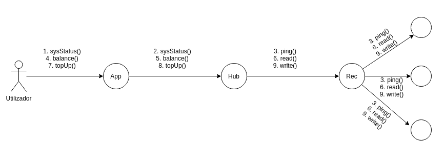
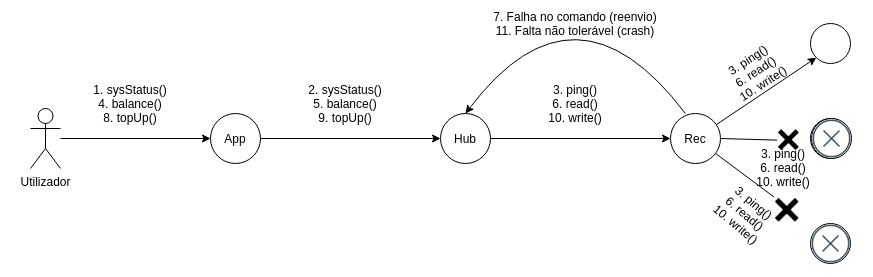

# Relatório do projeto *Bicloin*

Sistemas Distribuídos 2020-2021, segundo semestre

## Autores

**Grupo A68**

## Melhorias da primeira parte

- [Refatorização (organização do hub em métodos mais simples e com mais comentários)](https://git.rnl.tecnico.ulisboa.pt/SD-20-21-2/A68-Bicloin/commit/7fa4ce27f5ccb68eca5e64b96dbded991bf51f17)
- [Adicionar mais mensagens a explicar a execução](https://git.rnl.tecnico.ulisboa.pt/SD-20-21-2/A68-Bicloin/commit/9037df096ba58c8c67100428e9cb18390985b8b2)

## Modelo de faltas

####Faltas não toleradas:

De acordo com o nosso modelo, qualquer falta que cause a inconsistência de dados numa maioria das réplicas não é tolerada, visto que não garante coerência forte, ou seja, as leituras nem sempre observariam a versão mais recente.
Deste modo, é necessário obter um quórum de respostas, que garante a interseção de quaisquer dois subconjuntos de respostas. Isto é importante, pois ao existir esta interseção, sabemos que pelo menos alguma das réplicas tem a versão mais recente. Se os writes não o obtêm, não conseguimos garantir coerência forte (apenas os writes porque as chamadas read não vão alterar o estado dos dados).
Apesar disto, como é explicado no enunciado, nunca vai falhar uma maioria das réplicas em simultâneo.

####Faltas toleradas:

Por outro lado, toleramos reads e writes falhados, desde que seja numa minoria (e obtenhamos o quórum de respostas corretas). Por conseguinte, estamos a tolerar falhas de servidores Rec (desde que continuemos com um número de servidores - ativos e a responder - superiores ao número do quórum).
Toleramos também reads falhados, mas informamos o utilizador de que não foi possível fazer uma leitura correta, porque não conseguimos ter a certeza de termos lido a versão mais recente sem obtermos o quórum.
Toleramos também a falha do servidor do hub, informando o utilizador de que não foi possível contactar o servidor.
Em relação ao ping, toleramos todas as falhas, visto ser este mesmo o propósito dele - verificar e apresentar a disponibilidade dos servidores - pelo que não faria muito sentido falhar ao haver uma falha do servidor. Pelo contrário, ao tentar contactar, se falhar, apresenta uma mensagem de falha.

## Solução

_(Figura da solução de tolerância a faltas)_

O caso acima apresentado é a execução normal do programa, com todos os servidores ativos e a responder.
Como podemos ver, os pedidos são feitos pelo utilizador através da App, que reencaminha o pedido para ser executado no hub, que por sua vez o reencaminha para o Rec, caso seja preciso executar escritas/leituras. 
Nestes pedidos ao Rec, é enviado o pedido para cada uma das réplicas, que por sua vez irão responder. Assim que obtém o número de respostas suficiente, o Hub reencaminha a versão mais recente das várias respostas.
De modo a não implementar o conhecimento e execução dos comandos em todas as réplicas, para além do tratamento das respostas, temos um Frontend para o Rec, fazendo com que o Hub não tenha de conhecer os detalhes deste pedido.

Neste caso, temos dois servidores de Rec a falhar. Os pedidos feitos pelo utilizador são os mesmos (sysStatus, balance, topUp), mas podemos ver que nalguns as faltas são toleradas e noutros não.
Por exemplo, no caso do ping, apesar de não chegar a obter resposta dos servidores que estão em baixo, não é preciso fazer nenhum tratamento especial deste caso (funciona tal como no caso normal).
No caso do balance, que executa a chamada de leitura (read), ao não obter respostas suficientes para perfazer o quórum, vai retornar um erro (ponto 7 da imagem) e informar que será preciso reenviar o comando. Neste caso, não conseguimos confirmar ter a versão mais recente, logo não podemos devolver o valor lido porque não podemos garantir a coerência. Apesar disso, podemos tolerar a falta pois esta chamada, ao não alterar os dados, não vai causar a sua inconsistência.
Por fim, no caso do topUp, como são executadas chamadas de escrita (write) e continuamos sem obter um quórum de respostas, vamos ter de retornar um erro (ponto 11 da imagem). Porém, aqui não poderemos tolerar a falta, visto que se trata de uma escrita, e vai alterar o estado dos dados numa minoria das máquinas. Assim, se fosse feita uma leitura em seguida, podia não ser possível obter a versão mais recente dos dados, o que causa uma inconsistência. O que fazemos então nesse caso é retornar o erro e parar a execução do programa.

## Protocolo de replicação

O protocolo de replicação usado foi o de registo coerente com sistema de quóruns (versão base). 
Este vai funcionar da seguinte maneira: é calculado o número de quórum e a partir daí as chamadas de read e write ao servidor Rec têm que obter um número de respostas superior a esse número. Se não receber suficiente, dependendo do estado dos dados, pode ser preciso abortar o programa (explicado melhor no modelo de faltas).
Depois de receber respostas suficientes, verifica qual destas carrega a versão mais recente dos dados. Esta verificação é feita através da tag - um argumento das respostas, que consiste no número de sequência e no id de cliente. Assim, é possível "desempatar" as respostas: em primeiro lugar, escolhemos a que tem maior número de sequência (versão mais recente) e, no caso de serem iguais, escolhemos a que foi escrita pelo cliente com maior id (critério de desempate). É também desta forma que os servidores escolhem as respostas a armazenar: se o número de sequência for maior, quer dizer que a resposta é mais recente que a sua versão e faz sentido reescrever. Por outro lado, se não, quer dizer que a versão que está a receber é mais antiga e assim fará mais sentido manter a sua. No caso de serem iguais, usa também o id de cliente como critério de desempate.

No início da execução, no Hub, calculamos o número do quórum a partir do número de réplicas disponíveis no Zookeeper. No Rec, inicializamos a tag a (0,0) (número de sequência, id de cliente) para no Hub, quando queremos escrever, ler o valor da versão mais recente e incrementar.

## Medições de desempenho

| Medições                                              |
|-------------------------------------------------------|
| Número de pedidos read                                |
| Número de pedidos write                               |
| Rácio entre pedidos read/write                        |
| Tempo médio de execução de um pedido read             |
| Tempo médio de execução de um pedido write            |
| Desvio padrão do tempo de execução de um pedido read  |
| Desvio padrão do tempo de execução de um pedido write |

###Explicação:
No hub, qualquer pedido de leitura (readFromRec) ou escrita (writeToRec) é contabilizado após o mesmo ser realizado (ao retornar do frontend incrementa a respetiva variável) e o tempo de execução é calculado recorrendo ao método System.nanoTime (é guardado o tempo de início e fim do pedido, sendo a duração a sua diferença) e guardado numa lista.
Após lançar o servidor hub e a app, executam-se um número de comandos significativo (automatizado pelo ficheiro comandos.txt) e recolhem-se os dados.
Nota: cerca de 15 pedidos de escrita realizados pela inicialização dos dados, aquando do lançamento do servidor hub, são ignorados e apenas são contabilizados quaisquer comandos introduzidos na app.

## Opções de implementação

Enquanto que na versão base o quorum era apenas (numReplicas / 2), na versão melhorada acabámos por alterar o modo como o quorum é calculado (quando numReplicas >= 3), facilitando as operações de leitura, o que se pode notar nas tabelas em baixo (redução do tempo médio de execução de um pedido read).

###Versão base

| Medição | Valor      |
|---------|------------|
| (1)     | 183        |
| (2)     | 51         |
| (3)     | 3.59       |
| (4)     | 8.9899 ms  |
| (5)     | 16.9709 ms |
| (6)     | 6.1610 ms  |
| (7)     | 6.2257 ms  |

###Versão melhorada

| Medição | Valor      |
|---------|------------|
| (1)     | 183        |
| (2)     | 51         |
| (3)     | 3.59       |
| (4)     | 6.7220 ms  |
| (5)     | 17.3051 ms |
| (6)     | 4.1958 ms  |
| (7)     | 6.6075 ms  |
